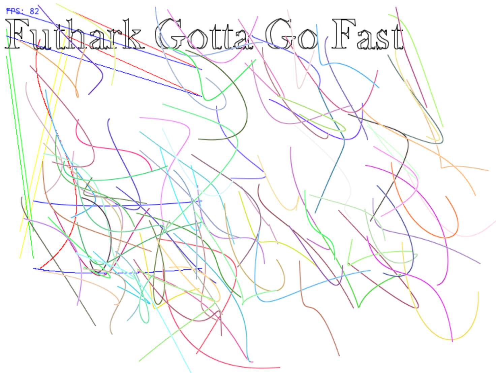

# Flattened Data-Parallel Generation of Cubic Bezier Curves

*By Martin Elsman, DIKU*



This application demonstrates the use of the _flattening by expansion_
technique [1] for drawing cubic bezier curves. The application is
written in [Futhark](http://futhark-lang.org) and builds on the
[Futhark Lys Library](https://github.com/diku-dk/lys).

## Running it

To build and run the application, do as follows:

````
$ futhark pkg sync
$ make
$ ./bezier -i
````

## Copyright and License

Copyright (c) Martin Elsman, DIKU

MIT License

## Future Work

By splitting the curves appropriately, we may be able to predict
better the exact number of pixels required to draw a continuous
line. It would also be great to see some antialiasing implemented.

## References

[1] Martin Elsman, Troels Henriksen, and Niels
G. W. Serup. Data-Parallel Flattening by Expansion. In Proceedings of
the 6th ACM SIGPLAN International Workshop on Libraries, Languages and
Compilers for Array Programming (ARRAY ‘19). Phoenix, AZ,
USA. June, 2019. [PDF](http://elsman.com/pdf/array19.pdf)
